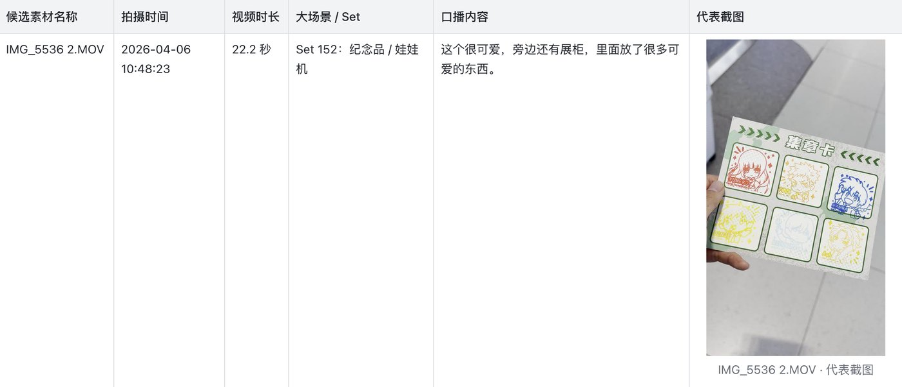

# Vlog Material Review Method

一套用于 Vlog / 旅行视频 / 探店视频粗剪前的素材整理方法和可复用工具包。

它的目标不是把每条素材写成复杂影评，而是在正式剪辑前，把大量原始视频整理成一张可检索、可筛选、可进入剪映 / Premiere / Final Cut 粗剪的素材表。

## 适合谁

- 拍了很多素材，但不知道从哪里开始剪的人
- 旅行 Vlog、邮轮 Vlog、探店、日常记录创作者
- 需要把素材先整理给剪辑师的人
- 想减少重复镜头、重复口播选择成本的人

## 核心思路

素材整理表重点回答三个问题：

1. 这个素材是什么？
2. 它属于哪个场景组，能和哪些素材互相替换？
3. 它有没有可用口播、关键信息或情绪点？

其中最重要的是 `Set` 分组：同一个 Set 里的素材通常是同一场景、同一动作、同一段口播的多次尝试，剪辑时只需要从候选素材中选最合适的一条或几条。

## 推荐表格字段

| 字段 | 用途 |
|---|---|
| 候选素材名称 | 原始文件名，作为素材 key |
| 拍摄时间 | 用于按真实时间线排序 |
| 视频时长 | 判断素材使用成本和剪辑节奏 |
| 大场景 / Set | 标记同一场景、同类镜头、可替换素材 |
| 口播内容 | 清晰口播保留原话，不清晰时写摘要，低可信留空 |
| 代表截图 | 方便快速扫图选素材 |

## 示例

| 候选素材名称 | 拍摄时间 | 视频时长 | 大场景 / Set | 口播内容 | 代表截图 |
|---|---|---:|---|---|---|
| IMG_0001.MOV | 2026-04-02 13:42 | 22.9 秒 | Set 001：抵达码头 / 建立镜头 | 好大的船啊。那是我们的船吗？看一下到底是哪一个。 | 1 张代表截图 |
| IMG_0002.MOV | 2026-04-02 13:45 | 3.5 秒 | Set 002：行李托运 | 现在开始进行行李托运。 | 1 张代表截图 |
| IMG_0003.MOV | 2026-04-02 13:46 | 15.6 秒 | Set 002：行李托运 | 托运很方便，原本以为要排很久，结果基本不用排队。 | 1 张代表截图 |

剪辑时，`IMG_0002.MOV` 和 `IMG_0003.MOV` 属于同一个 Set，不一定都要用，可以按画面、口播自然度和节奏择优。

整理完成后的表格效果示意：



## 一键使用

### 1. 安装依赖

先安装 `ffmpeg`：

```bash
brew install ffmpeg
```

安装 Python 依赖：

```bash
python3 -m venv .venv
source .venv/bin/activate
pip install -r requirements.txt
```

检查环境：

```bash
bash scripts/preflight.sh
```

如果需要本地口播识别，再安装可选依赖：

```bash
pip install -r requirements-transcription.txt
```

也可以把工具安装成命令：

```bash
pip install -e .
vlog-material-review examples/project_config.example.json
```

### 2. 复制配置

```bash
cp examples/project_config.example.json my_project.json
```

编辑 `my_project.json`，填入素材目录、项目名称、重要地点、人名和专有词。

### 3. 生成素材表

```bash
python tools/vlog_material_review.py my_project.json
```

默认会输出：

- `rows.json`：结构化素材数据
- `material_review.csv`：表格数据
- `material_review.md`：Markdown 表格
- `material_review.html`：带截图的本地预览页
- `frames/`：代表截图

## 工具链说明

默认工具链不依赖云端 API：

| 任务 | 默认工具 | 说明 |
|---|---|---|
| 读取拍摄时间 / 时长 | `ffprobe` | 来自 ffmpeg |
| 抽代表截图 | `ffmpeg` | 每条素材抽 1-3 张 |
| 生成表格 | Python 标准库 | 输出 JSON / CSV / Markdown / HTML |
| 口播识别 | 可选 `faster-whisper` | 本地 Whisper，适合先生成底稿 |
| 画面理解 | 代表帧 + 人工/AI 校正 | 默认不绑定特定云服务 |

这套工具会先生成可复核的本地预览。更强的 AI 视觉理解、云端 ASR、飞书/Notion 写入，可以在这个结果基础上扩展。

## Agent / Skill 用法

这个仓库也可以作为 Agent skill 使用。核心入口文件：

- `SKILL.md`：告诉 Agent 什么时候使用、如何对话、如何运行。
- `RULES.md`：素材整理的硬规则，尤其是 Set、截图、口播清洗。
- `CATALOG.md`：不同项目可选的整理模式。
- `scripts/preflight.sh`：前置依赖检查。

如果你的 Agent 支持从 GitHub 安装 skill，可以安装本仓库后直接让它读取 `SKILL.md`。

## 使用流程

1. 扫描素材
   - 读取文件名、拍摄时间、视频时长。
   - 按拍摄时间排序。

2. 抽代表帧
   - 短视频、画面变化小：1 张代表截图。
   - 长运镜、前后画面差异大：2-3 张截图。

3. 识别场景并生成 Set
   - 根据画面、时间、文件相邻关系，归并同类素材。
   - 同一场景重复拍摄的素材归入同一 Set。

4. 处理口播
   - 清晰口播：保留原话并修正标点。
   - 嘈杂对话：整理成摘要式口播。
   - 低可信识别：留空，不要污染表格。

5. 本地预览
   - 先生成 HTML、CSV、Markdown 或表格预览。
   - 检查字段、截图大小、Set 是否合理。

6. 写入在线文档
   - 确认本地预览后，再写入飞书、Notion、Google Docs 等在线文档。
   - 大表建议分段写入，避免接口超时。

7. 粗剪
   - 按时间线浏览 Set。
   - 每个 Set 选 A/B/C 候选。
   - 有口播的素材判断是否保留原声或做字幕。
   - 无口播但画面好的素材作为 B-roll / 转场 / 氛围镜头。

## 口播校正原则

口播不应该盲目追求逐字稿，而应该追求“剪辑可用”。

推荐做法：

- 清晰近距离口播：尽量保留原话。
- 多人对话 / 环境嘈杂：整理成摘要。
- 背景广播、风声、音乐、远处人声：通常留空。
- AI 明显幻觉：删除。
- 校正时结合项目背景、当前场景、画面内容和专有词。

例如旅行 Vlog 中，地名、交通工具、景点名、餐厅名、同行人称呼都可以作为校正参考；但听不清的内容不要强行脑补。

## 模板

完整方法见：

[templates/video_material_review_method.md](templates/video_material_review_method.md)

工具链说明见：

[docs/tooling.md](docs/tooling.md)

AI 辅助流程见：

[docs/ai-workflow.md](docs/ai-workflow.md)

输出数据结构见：

[docs/output-schema.md](docs/output-schema.md)

## 目录结构

```text
.
├── README.md
├── tools/
│   └── vlog_material_review.py
├── scripts/
│   └── preflight.sh
├── examples/
│   └── project_config.example.json
├── templates/
│   └── video_material_review_method.md
├── docs/
│   ├── tooling.md
│   ├── ai-workflow.md
│   └── output-schema.md
├── requirements.txt
├── requirements-transcription.txt
├── pyproject.toml
├── SKILL.md
├── RULES.md
├── CATALOG.md
├── CONTRIBUTING.md
├── CHANGELOG.md
└── LICENSE
```

## 开源许可

MIT License
